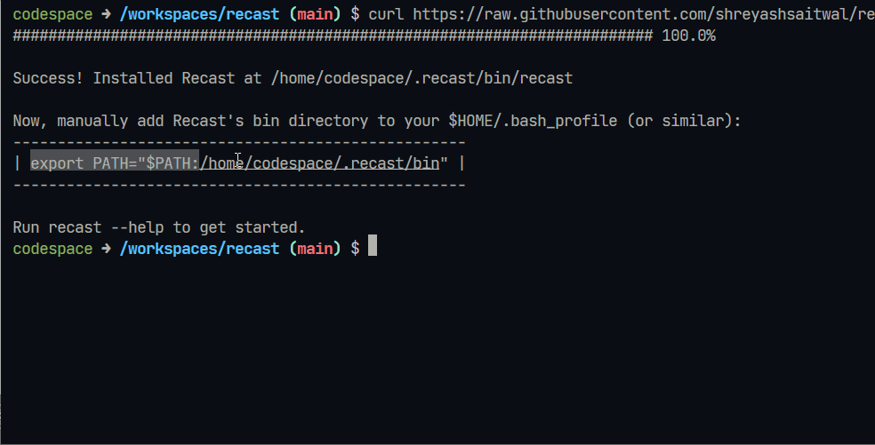

# Recast

Recast helps make your old extensions compatible with Kodular Creator version 1.5.0 or above.

## Prerequisites

To use Recast, you need to have Java Runtime Environment (JRE) installed on your system. To check if you have it
pre-installed, open your favorite terminal app and run the following:

```.sh
java -version
```

If you get an output similar to below, JRE is already available on your system.

```.sh
java version "1.8.0_281"
Java(TM) SE Runtime Environment (build 1.8.0_281-b09)
```

If you don't see an output similar to the above, you will need to install Java before installing Recast.

## Installing

Recast is a command-line tool, and therefore, you first need to install it on your computer to use it. As of now, Recast
can be installed on the following operating systems:

* Windows (64 bit)
* macOS (x86_64 arch)
* GNU/Linux (x86_64 arch)

### Using PowerShell (Windows)

1. Open PowerShell.
2. Copy and paste the following and hit enter:
    
   ```.ps1
    iwr https://raw.githubusercontent.com/shreyashsaitwal/recast/main/scripts/install.ps1 -useb | iex
    ```
3. Done! Run `recast --help` to verify installation.

### Using Shell (macOS and Linux)

1. Open your favorite shell (terminal).
2. Copy and paste the following and hit enter:
    
   ```.sh
    curl https://raw.githubusercontent.com/shreyashsaitwal/recast/main/scripts/install.sh -fsSL | sh
    ```
3. Once the download is complete, add Recast to your `PATH` by copying the export command from the output (as shown
   below) and running it:
   
    
4. Done! Run `recast --help` to verify installation.

## Usage

### Recasting extensions (AIX)

To make your old extension compatible with Kodular >1.5.0 using Recast, go through the following steps:

1. Navigate to the directory/folder where your extension is placed.
2. Open your favorite terminal in that directory.
3. Now, run the following:
    ```.sh
    recast --input you.extension.aix
    ```
   (Here, `your.extension.aix` is the name of your extension)
4. Bingo! A new, recasted extension with the name `your.extension.x.aix` is generated in the current working and ready
   to be used.

### Recasting AIAs

Starting with Recast v0.2.0, you get the ability to recast your AIA files as well. This reduces the manual work of
re-importing every recasted extension in your project.

1. Navigate to the directory/folder where your AIA is placed.
2. Open your favorite terminal in that directory.
3. Now, run the following:
    ```.sh
    recast --input you_app.aia
    ```
   (Here, `you_app.aia` is the name of your AIA file)
4. And there you go! All the extensions in your AIA are now recasted, and the new AIA can be found in the same directory with
   name `your_app_x.aia`.

> **Note:**
When you import a recasted AIA in Kodular (or AI2), your existing project isn't affected. Instead, a separate project with name `your_app_x` is created with all the existing work preserved.

## Tips

* You can recast multiple extensions/AIAs all at once by gathering them all in one directory and then running:
  ```.sh
  recast --input directory_path
  ```
  (Here, `directory_path` is the path to the directory where extensions/AIAs are stored.)

* If you want to output the recasted extension/AIAs in a separate directory, all you need to do is specify
  the `--output` option and pass the path to your desired directory.
    ```.sh
    recast --input you_aix_or_aia --output output_dir_path
    ```
  (Here, `output_dir_path` is the path to the output directory.)

## FAQ

1. Do I need to recast every extension to make it compatible with Kodular >1.5.0?<br>
   **Ans.** No, you don't need to. Only the extensions that started throwing errors after the latest update need to be
   recasted.

2. Why does Recast print **`No references to support libraries found`** when I try to recast my extension?<br>
   **Ans.** It means that your extension is already compatible with Kodular >1.5.0, and you don't need to recast it.
